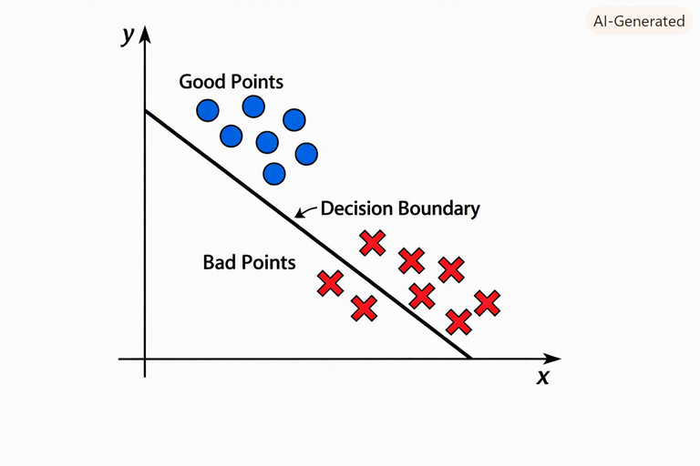

> “What I cannot create, I do not understand” 

was found on Richard Feynman's blackboard at Caltech after he died.

At this year's NYU Tandon [commencement address](https://www.youtube.com/watch?v=pFscM-Z4rCE)
Yann LeCun said "Large Language Models do not create anything." And encouraged
students to learn how they work and use them to create new things.
He emphasised you will be at a disadvantage if you don't learn how to use them effectively.

The most valuable commodity in the world is trust.
It cannot be manufacured or bought, and can vanish in an instant.

You need to figure out who you can trust. It is the oldest problem in the world.

### People I Trust

Yann Lecun - Head of Facebook AI until starting AMIL in 2025.

Andrei Karpathy - OpenAI GPT-1, GPT-2

Ali Gosdsi - Founder of Databricks

## A Short History of Machine Learning

The origins of ML began in 1805 with Gauss and Legendre inventing the
"least squares" method. 
Given points $(x_j, y_j)$ find a line $y = ax + b$ that "best" fits the data.
They proposed minimizing the _loss function_
$$
	L(a,b) = \sum_j (ax_j + b - y_j)^2
$$
over $a$ and $b$.

From 1930--1940 statisical theory advanced with more general linear models in
higher dimensions _maximum likelihood_ methods.

[@McCPit1943] gave the first mathematical definition of a neuron.

[@Ros1958] coined the term _perceptron_ and implemented it in hardware.
Given "good" points $(x_i,y_i)$ and "bad" points $(x_j',y_j')$ find a
line separating them.

@MinPap1969] set the field back by showing a perceptron could not be trained on XOR.

It wasn't until 1980-1995 that people realized you could solve this with _neural networks_:
layers of perceptron with output of each layer providing input for the next.
This is also when _reinforcement learning_ was developed.

From 1995-2012 _statistical learning_ was developed:
Expectation Maximization, Hidden Markov Models, decision trees, random forests, ...
Models were small and understandable.

The _deep learning_ started in 2012 when Moore's Law made
computing power and memory available. No new techniques were invented
until _transformers_ [@Vas2017] "Attention Is All You Need." It allowed
models to run in parallel instead of sequentially.

Source code for early OpenAI model [gpt-2](https://github.com/openai/gpt-2/blob/master/src/model.py)

## LLM

A large language model is a function and a _context_. Given a sequence of characters it
returns a sequence of characters.  It takes training data consisting of "correct" answers and interpolates.

So called "prompt engineering" is really about context engineering.

The simple prompt "yes" will clue you in to the current context
of the LLM you are using at the moment.
Use the output to detect what it is _not_ telling you.

